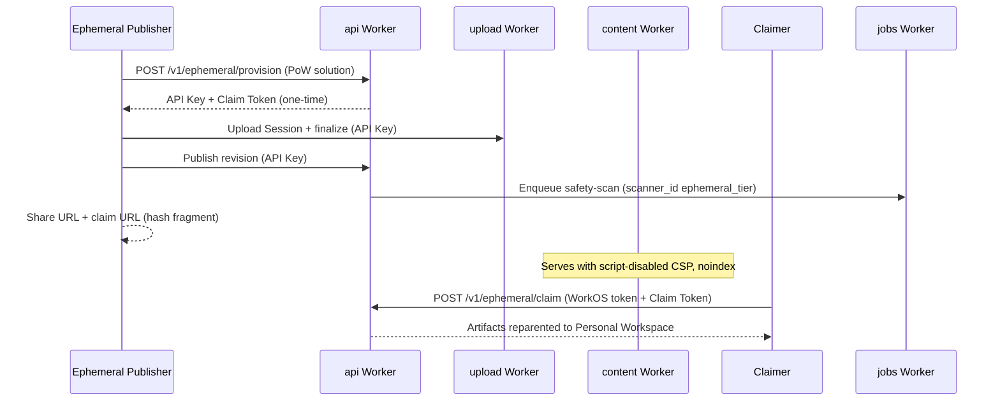

# Ephemeral Publish Operator Runbook

Operator and support guide for **Ephemeral Publish**, **Ephemeral Workspace** lifecycle,
**Claim Token** handling, abuse response, and smoke verification. Uses domain language from
`CONTEXT.md` and does not record secrets, API keys, Claim Tokens, signed URL secrets, or
customer data.

Scope:

- Proof-of-work provision, CLI `publish --ephemeral`, claim redemption, content policy
  (24h **Auto Deletion**, `noindex`, script-disabled serving), ephemeral-tier **Safety Scanner**
  routing, and **Platform Lockdown**
- Local and hosted smoke evidence (AP-110/AP-111)
- Support responses for lost, expired, or redeemed **Claim Tokens**

Out of scope:

- Product marketing copy
- Stripe checkout / `pro` upgrade (AP-5, AP-109)
- Implementing new API or UI surfaces

Related docs:

- [Ephemeral publish spec](../specs/ephemeral-publish.md) — buildable product shape
- [ADR 0075](../adr/0075-agent-first-ephemeral-publish-and-write-gated-monetization.md) — decision and trust ladder
- [Hosted ops](./status/hosted-ops.md) — deploy order, `EPHEMERAL_POW_SECRET`, hosted smoke env vars
- [WorkOS runbook](./runbook-workos.md) — member auth for claim redemption
- [Project status](./project-status.md) — current slice state

## Availability snapshot

| Layer                               | Status                  | How to confirm                                      |
| ----------------------------------- | ----------------------- | --------------------------------------------------- |
| API provision + claim routes        | Shipped                 | PoW probe and smokes (below)                        |
| CLI `publish --ephemeral`           | Shipped (AP-107)        | `pnpm smoke:local` ephemeral section                |
| Web claim UX                        | Shipped (AP-108)        | `/claim#…` redemption in browser                    |
| Script-disabled + `noindex` serving | Shipped (AP-102/AP-104) | Content/agent-view policy assertions in smokes      |
| Local end-to-end smoke              | Shipped (AP-110)        | `pnpm smoke:local`                                  |
| Hosted preview/PR smoke             | Shipped (AP-111)        | `pnpm smoke:preview:ephemeral`, PR preview workflow |
| Hosted production smoke             | Operator-run (AP-111)   | `pnpm smoke:production:ephemeral` with approval     |
| Claim/upgrade funnel polish         | Remaining (AP-109)      | Product UX beyond redemption                        |

**User-facing end-to-end availability** requires hosted smokes to pass in the target
environment (preview CI or an operator-approved production run). Implementation can be
complete on `main` while a specific deploy is not yet live if `EPHEMERAL_POW_SECRET` is
missing or smokes skip.

## Flow overview



1. **Provision** — `POST /v1/ephemeral/provision` after solving a hashcash-style proof-of-work
   challenge. Creates an **Ephemeral Workspace** (`workspaces.claimed_at IS NULL`), a short-lived
   **API Key** (`write` + `read` only), and a one-time **Claim Token** (stored hashed; plaintext
   returned once).
2. **Publish** — Standard **Upload Session** → finalize → publish using the minted **API Key**
   (CLI: `agent-paste publish <path> --ephemeral`).
3. **Share** — Public **Agent View** and content URLs never embed the **Claim Token**. The CLI
   prints `claim_url` as `{web_origin}/claim#{claim_token}` (fragment, not query string).
4. **Claim** — Authenticated **Workspace Member** calls `POST /v1/ephemeral/claim` or uses the web
   `/claim` page. Content reparents into the member's **Personal Workspace**; source ephemeral
   tenant is consumed (`claimed_at` set).
5. **Auto Deletion** — Unclaimed ephemeral **Artifacts** use a 24h cap; the jobs sweep enforces
   deletion on schedule.

## Policy and abuse controls

| Control                          | Ephemeral (unclaimed)                                                  | After claim (`free`+)       |
| -------------------------------- | ---------------------------------------------------------------------- | --------------------------- |
| Daily new **Artifact** allowance | 20                                                                     | 100 (`free`) / higher tiers |
| **Auto Deletion**                | 24h cap                                                                | Platform default (30d+)     |
| Indexing                         | `noindex` / `nofollow` on content + Agent View HTML                    | Default                     |
| Script execution                 | Script-disabled **Execution Policy** (`script-src 'none'`)             | CDN-allowlisted policy      |
| **Safety Scanner**               | `scanner_id` = `ephemeral_tier` (Llama Guard 3 + URL Scanner advisory) | Built-in scanner path       |
| Malicious verdict                | **Platform Lockdown** (workspace or artifact scope)                    | Same                        |

Proof-of-work and dedicated rate-limit bindings on provision dampen provision abuse. Reads stay
gated only by the existing **Artifact Rate Limit** — not by publisher tier.

## Is ephemeral live?

Use these checks in order. None require pasting a **Claim Token** or API key into tickets,
logs, or docs.

### 1. PoW readiness probe (safe, read-only)

```sh
curl -sS -X POST "${API_BASE}/v1/ephemeral/provision" \
  -H 'accept: application/json' \
  -H 'content-type: application/json' \
  -d '{}'
```

| Response                                                   | Meaning                                                               |
| ---------------------------------------------------------- | --------------------------------------------------------------------- |
| `401` + `error.code` = `pow_required` + `challenge` object | Ephemeral provision is configured (`EPHEMERAL_POW_SECRET` present)    |
| `database_unavailable` or missing challenge                | `EPHEMERAL_POW_SECRET` not set on the API Worker for this environment |
| Unexpected 5xx                                             | Investigate API health, DB/Hyperdrive, or recent deploy               |

Replace `API_BASE` with the environment API origin (preview, PR, or production). This probe
does not mint a tenant.

### 2. Automated smokes (preferred evidence)

| Command                           | When                                       | Pass evidence                                                           |
| --------------------------------- | ------------------------------------------ | ----------------------------------------------------------------------- |
| `pnpm smoke:local`                | After `pnpm build`; uses in-memory harness | Stdout includes `Ephemeral:` line with `art_…` and claimed workspace id |
| `pnpm smoke:preview:ephemeral`    | After preview deploy                       | `Preview ephemeral hosted smoke passed` + artifact/workspace ids        |
| `pnpm smoke:pr:ephemeral`         | PR preview workflow (automatic)            | Same as preview; uses `AGENT_PASTE_PR_*` URLs                           |
| `pnpm smoke:production:ephemeral` | Operator-approved production only          | `Production ephemeral hosted smoke passed`                              |

Smokes assert, without logging secrets:

- Provision → publish → **Agent View** / content fetch
- `script-src 'none'` on content CSP, `x-robots-tag: noindex, nofollow`
- Inline script in the fixture does not execute (title unchanged)
- **Claim Token** not present in `view_url`, **Agent View** JSON/HTML, or stderr
- Fresh ephemeral **usage-policy** daily allowance = 20
- Claim redemption when WorkOS member auth is available (local smoke always; hosted optional)

See [Hosted ops — ephemeral smoke](./status/hosted-ops.md#hosted-ephemeral-publish-smoke) for
skip behavior when `EPHEMERAL_POW_SECRET` or harness secrets are absent (exit **0** with a
skip message — not a false pass).

### 3. Public content policy spot-check (no credentials)

Given only a public share URL from a reporter or smoke output (not the Claim Token):

```sh
curl -sSI "${VIEW_URL}" | rg -i 'content-security-policy|x-robots-tag'
```

Expect:

- `content-security-policy` containing `script-src 'none'`
- `x-robots-tag: noindex, nofollow`

For HTML **Agent View** in a browser or `curl -H 'accept: text/html'`:

```sh
curl -sS -H 'accept: text/html' "${AGENT_VIEW_URL}" | head
```

Expect `noindex` in headers/meta and no **Claim Token** substring in the body.

### 4. Verify ephemeral vs claimed (operators with DB access)

Use read-only SQL in the Neon console (migration role not required for `SELECT`):

```sql
-- Workspace still ephemeral?
select id, claimed_at, plan from workspaces where id = '<workspace_id>';

-- Claim Token row (never select token_hash for support tickets)
select id, public_id, expires_at, redeemed_at
from claim_tokens
where workspace_id = '<workspace_id>';
```

| Signal                                        | Ephemeral (unclaimed)  | Claimed                                                  |
| --------------------------------------------- | ---------------------- | -------------------------------------------------------- |
| `workspaces.claimed_at`                       | `NULL`                 | Timestamp set                                            |
| **Agent View** JSON (`GET` public agent view) | `ephemeral_tier: true` | Field absent / false                                     |
| Content CSP                                   | Script-disabled        | Normal CDN-allowlisted policy for new tokens after claim |

Do not export `token_hash`, API key material, or signed URL query parameters into Linear,
email, or this runbook.

### 5. Operator UI and lockdown

- **Platform Lockdown** — Use the web `/admin` operator UI (WorkOS `admin` + Cloudflare Access)
  to set workspace- or artifact-scoped lockdown after a malicious **Safety Scanner** verdict or
  abuse report. See [ADR 0040](../adr/0040-platform-lockdown-for-operator-initiated-takedown.md).
- **Audit / operator events** — AP-16 operator event browsing can corroborate provision, claim,
  and lockdown actions without exposing **Claim Token** plaintext.

## Abuse and takedown

1. **Confirm the target** — Collect `artifact_id`, public share URL, and report time. Do not ask
   the reporter for their **Claim Token**.
2. **Assess tier** — Fetch public **Agent View** or content headers (above). Ephemeral content
   should already be `noindex` and script-disabled.
3. **Lock down** — Apply **Platform Lockdown** at artifact or workspace scope via operator APIs/UI.
   Ephemeral viral links do not grant claim power; lockdown is independent of claim state.
4. **Scanner follow-up** — Check whether `ephemeral_tier` safety scan enqueued a warning or drove
   automatic lockdown. Jobs consumer uses `scanner_id` `ephemeral_tier` per
   `packages/contracts/src/jobs.ts`.
5. **Provision abuse** — If provision volume spikes, review ephemeral provision rate-limit metrics
   and PoW difficulty config before considering manual blocks. Do not disable PoW without an ADR.
6. **Retention** — Unclaimed content ages out on the 24h ephemeral **Auto Deletion** schedule even
   without manual delete. Prefer lockdown for active harm; rely on TTL for cleanup.

## Support: Claim Token cases

| Situation                    | Guidance                                                                                                                                                                                                          |
| ---------------------------- | ----------------------------------------------------------------------------------------------------------------------------------------------------------------------------------------------------------------- |
| Lost **Claim Token**         | We cannot recover ownership. The token is one-time and stored hashed; support has no lookup by public URL. The publisher must run **Ephemeral Publish** again and save the new token.                             |
| Expired token                | `POST /v1/ephemeral/claim` returns generic `404`. Content remains until **Auto Deletion**; reclaim requires a new publish + claim.                                                                                |
| Already redeemed             | Same `404` on reuse. Content now lives in the claimer's **Personal Workspace**; only that member's dashboard access applies.                                                                                      |
| Token in email/chat leak     | Treat as compromised. If not yet redeemed, attacker could claim — advise immediate claim by the legitimate member, or republish. Never paste the token into support tickets.                                      |
| "I only have the share link" | Possession of the share URL does **not** grant ownership. Without the **Claim Token**, promotion is impossible by design ([ADR 0075](../adr/0075-agent-first-ephemeral-publish-and-write-gated-monetization.md)). |
| Unclaimed content expired    | After **Auto Deletion**, content is gone. Republish; there is no restore path for anonymous-tier tenants.                                                                                                         |

Web redemption: authenticated users open the CLI-printed `claim_url` (`/claim#{token}`). The
fragment is not sent to the server on normal navigation in all browsers — the web app reads the
hash client-side; do not ask users to convert the link to a query parameter.

## CLI reference (support)

```sh
agent-paste publish <path> --ephemeral [--title <text>] [--ttl 1d] [--json]
```

- Ignores `AGENT_PASTE_API_KEY` and stored login credentials.
- Default TTL is one day (ephemeral cap). `--json` prints `artifact_id`, `view_url`,
  `agent_view_url`, `claim_url`, and `claim_token` — support scripts must redact `claim_token`
  when logging.
- PoW failures and rate limits surface as stable CLI error codes (for example
  `ephemeral_provision_rate_limited`).

Local harness: `pnpm dev:all` then `pnpm cli:dev publish <absolute-path> --ephemeral` with
`AGENT_PASTE_*_URL` exports from the harness banner.

## Configuration secrets

| Secret / binding                                  | Worker     | Purpose                                                    |
| ------------------------------------------------- | ---------- | ---------------------------------------------------------- |
| `EPHEMERAL_POW_SECRET`                            | `api`      | Sign and verify PoW challenges                             |
| `EPHEMERAL_PROVISION_IP_RATE_LIMIT`               | `api`      | Per-IP provision dampening                                 |
| `EPHEMERAL_PROVISION_GLOBAL_RATE_LIMIT`           | `api`      | Global provision backstop                                  |
| `AGENT_PASTE_*_SMOKE_HARNESS_SECRET`              | smoke only | Preview/PR artifact cleanup via `__test__/delete-artifact` |
| `AGENT_PASTE_EPHEMERAL_SMOKE_WORKOS_ACCESS_TOKEN` | smoke only | Optional hosted claim redemption check                     |

Bootstrap preview/production API secrets with `pnpm bootstrap:preview` /
`pnpm bootstrap:production` when operator-approved. PR previews can seed via
`PR_PREVIEW_SECRET_SEED` (see hosted-ops).

## Failure modes

| Symptom                                  | Likely cause                                          | Action                                                   |
| ---------------------------------------- | ----------------------------------------------------- | -------------------------------------------------------- |
| PoW probe returns `database_unavailable` | Missing `EPHEMERAL_POW_SECRET` on API Worker          | Set secret, redeploy `api`, re-run smoke                 |
| Hosted smoke exits 0 with "skipped"      | Secret absent or `AGENT_PASTE_SKIP_EPHEMERAL_SMOKE=1` | Configure secrets; do not treat skip as production proof |
| CLI `--ephemeral` rate limited           | Provision abuse or per-IP cap                         | Retry with backoff; investigate source IP volume         |
| Claim returns 404                        | Redeemed, expired, or invalid token                   | See support table; no token recovery                     |
| Content executes script                  | Claimed tenant or wrong tier token                    | Verify `claimed_at`, re-fetch CSP from content URL       |
| Scanner lockdown loop                    | Malicious verdict on ephemeral content                | Review warning payload; lift only after remediation      |

## Verification boundary

- Safe for CI and remote agents: `pnpm smoke:local`, unit tests, PoW probe, public header checks.
- Requires hosted credentials or operator approval: `pnpm smoke:preview:ephemeral`,
  `pnpm smoke:production:ephemeral`, production deploys.
- Never commit **Claim Tokens**, API keys, or `AGENT_PASTE_EPHEMERAL_SMOKE_WORKOS_ACCESS_TOKEN`
  values to the repo, Linear, or PR comments.
