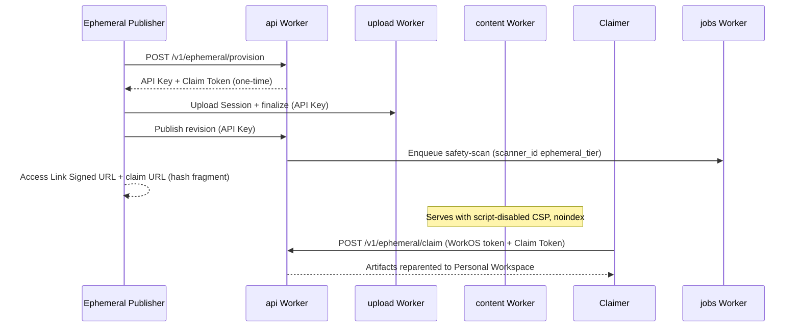

# Ephemeral Publish Operator Runbook

Operator and support guide for **Ephemeral Publish**, **Ephemeral Workspace** lifecycle,
**Claim Token** handling, abuse response, and smoke verification. Uses domain language from
`CONTEXT.md` and does not record secrets, API keys, Claim Tokens, signed URL secrets, or
customer data.

Scope:

- Provision, CLI `publish --ephemeral`, claim redemption, content policy
  (24h **Auto Deletion**, `noindex`, script-disabled serving), advisory warning
  metadata, Llama Guard/URL Scanner signals, and **Platform Lockdown**
- Local and hosted smoke evidence (AP-110/AP-111)
- Support responses for lost, expired, or redeemed **Claim Tokens**

Out of scope:

- Product marketing copy
- New Stripe checkout / `pro` entitlement implementation (AP-5/AP-109 are shipped)
- Implementing new API or UI surfaces

Related docs:

- [Ephemeral publish spec](../specs/ephemeral-publish.md) — buildable product shape
- [ADR 0075](../adr/0075-agent-first-ephemeral-publish-and-write-gated-monetization.md) — decision and trust ladder
- [Hosted ops](./status/hosted-ops.md) — deploy order, provision gate config, hosted smoke env vars
- [WorkOS runbook](./runbook-workos.md) — member auth for claim redemption
- [Project status](./project-status.md) — current slice state

## Availability snapshot

| Layer                               | Status                  | How to confirm                                      |
| ----------------------------------- | ----------------------- | --------------------------------------------------- |
| API provision + claim routes        | Shipped                 | Provision probe and smokes (below)                  |
| CLI `publish --ephemeral`           | Shipped (AP-107)        | `pnpm smoke:local` ephemeral section                |
| Web claim UX                        | Shipped (AP-108)        | `/claim#…` redemption in browser                    |
| Script-disabled + `noindex` serving | Shipped (AP-102/AP-104) | Content/agent-view policy assertions in smokes      |
| Ephemeral advisory warning path     | Shipped (AP-104)        | `safety-scan` with `scanner_id=ephemeral_tier`      |
| Local end-to-end smoke              | Shipped (AP-110)        | `pnpm smoke:local`                                  |
| Hosted preview/PR smoke             | Shipped (AP-111)        | `pnpm smoke:preview:ephemeral`, PR preview workflow |
| Hosted production smoke             | Operator-run (AP-111)   | `pnpm smoke:production:ephemeral` with approval     |
| Claim/upgrade funnel polish         | Shipped (AP-109)        | Post-claim success UI and upgrade CTA               |

**User-facing end-to-end availability** requires hosted smokes to pass in the target
environment (preview CI or an operator-approved production run). Implementation can be
complete on `main` while a specific deploy is not yet live if the deployed Worker is
stale or smokes skip by explicit flag.

## Flow overview



1. **Provision** — `POST /v1/ephemeral/provision` creates an **Ephemeral Workspace**
   (`workspaces.claimed_at IS NULL`), a short-lived **API Key** (`write` + `read` only), and a
   one-time **Claim Token** (stored hashed; plaintext returned once). Provision first passes
   native rate limits and the Durable Object gate, then waits for the configured server-side
   delay before DB provisioning. The wait is friction, not a security boundary.
2. **Publish** — Standard **Upload Session** → finalize → publish using the minted **API Key**
   (CLI: `agent-paste publish <path> --ephemeral`).
3. **Share** — Public **Agent View** and content URLs never embed the **Claim Token**. The CLI
   prints `claim_url` as `{web_origin}/claim#{claim_token}` (fragment, not query string).
4. **Claim** — Authenticated **Workspace Member** calls `POST /v1/ephemeral/claim` or uses the web
   `/claim` page. Content reparents into the member's **Personal Workspace**; source ephemeral
   tenant is consumed (`claimed_at` set).
5. **Auto Deletion** — Unclaimed ephemeral **Artifacts** use a 24h cap; the jobs sweep enforces
   deletion on schedule.

## Policy and abuse controls

| Control                          | Ephemeral (unclaimed)                                        | After claim (`free`+)       |
| -------------------------------- | ------------------------------------------------------------ | --------------------------- |
| Daily new **Artifact** allowance | 20                                                           | 100 (`free`) / higher tiers |
| **Auto Deletion**                | 24h cap                                                      | Platform default (30d+)     |
| Indexing                         | `noindex` / `nofollow` on content + Agent View HTML          | Default                     |
| Script execution                 | Script-disabled **Execution Policy** (`script-src 'none'`)   | CDN-allowlisted policy      |
| Warning metadata                 | Built-in rules, dormant-script warning, optional Llama Guard | Built-in rules              |
| URL Scanner signal               | Malicious verdict can trigger artifact **Platform Lockdown** | Not on default claimed path |
| Abuse response                   | Operator **Platform Lockdown** (workspace or artifact scope) | Same                        |

Provision rate limits dampen provision abuse. Reads stay gated only by the existing **Artifact
Rate Limit** — not by publisher tier.

Warning metadata and URL Scanner verdicts are advisory and abuse-response signals. They do not
certify content as safe, promise malware detection, or replace the isolation, signed access,
rate limits, revocation, and deletion controls.

## Is ephemeral live?

Use these checks in order. None require pasting a **Claim Token** or API key into tickets,
logs, or docs.

### 1. Provision readiness probe

```sh
curl -sS -X POST "${API_BASE}/v1/ephemeral/provision" \
  -H 'accept: application/json' \
  -H 'content-type: application/json' \
  -d '{}'
```

| Response                                           | Meaning                                                      |
| -------------------------------------------------- | ------------------------------------------------------------ |
| `201` + credential and Claim Token fields          | Provision route, rate limits, gate, wait, and DB are healthy |
| `ephemeral_provision_rate_limited` + `Retry-After` | Provision rate limits or the DO gate are applying            |
| `ephemeral_provision_unavailable` + `Retry-After`  | Gate binding/config/storage failed closed                    |
| Unexpected 5xx                                     | Investigate API health, DB/Hyperdrive, or recent deploy      |

Replace `API_BASE` with the environment API origin (preview, PR, or production).
This probe mints an Ephemeral Workspace. Prefer the hosted smoke harness when
cleanup matters.

### 2. Automated smokes (preferred evidence)

| Command                           | When                                       | Pass evidence                                                           |
| --------------------------------- | ------------------------------------------ | ----------------------------------------------------------------------- |
| `pnpm smoke:local`                | After `pnpm build`; uses in-memory harness | Stdout includes `Ephemeral:` line with `art_…` and claimed workspace id |
| `pnpm smoke:preview:ephemeral`    | After preview deploy                       | `Preview ephemeral hosted smoke passed` + artifact/workspace ids        |
| `pnpm smoke:pr:ephemeral`         | PR preview workflow (automatic)            | Same as preview; uses `AGENT_PASTE_PR_*` URLs                           |
| `pnpm smoke:production:ephemeral` | Operator-approved production only          | `Production ephemeral hosted smoke passed`                              |

Smokes assert, without logging secrets:

- Provision → publish → **Agent View** / content fetch
- `script-src 'none'` on content CSP, `x-robots-tag: noindex, nofollow`
- Inline script in the fixture does not execute (title unchanged)
- **Claim Token** not present in `private_url`, `revision_content_url`, **Agent View** JSON/HTML, or stderr
- Fresh ephemeral **usage-policy** daily allowance = 20
- Claim redemption when WorkOS member auth is available (local smoke always; hosted optional)

See [Hosted ops — ephemeral smoke](./status/hosted-ops.md#hosted-ephemeral-publish-smoke) for
skip behavior when `AGENT_PASTE_SKIP_EPHEMERAL_SMOKE=1` is set (exit **0** with a
skip message — not a false pass).

### 3. Public content policy spot-check (no credentials)

Given only a public Access Link Signed URL from a reporter or smoke output (not the Claim Token):

```sh
curl -sSI "${VIEW_URL}" | rg -i 'content-security-policy|x-robots-tag'
```

Expect:

- `content-security-policy` containing `script-src 'none'`
- `x-robots-tag: noindex, nofollow`

For HTML **Agent View** in a browser or `curl -H 'accept: text/html'`:

```sh
curl -sS -H 'accept: text/html' "${AGENT_VIEW_URL}" | head
```

Expect `noindex` in headers/meta and no **Claim Token** substring in the body.

### 4. Verify ephemeral vs claimed (operators with DB access)

Use read-only SQL in the Neon console (migration role not required for `SELECT`):

```sql
-- Workspace still ephemeral?
select id, claimed_at, plan from workspaces where id = '<workspace_id>';

-- Claim Token row (never select token_hash for support tickets)
select id, public_id, expires_at, redeemed_at
from claim_tokens
where workspace_id = '<workspace_id>';
```

| Signal                                        | Ephemeral (unclaimed)  | Claimed                                                  |
| --------------------------------------------- | ---------------------- | -------------------------------------------------------- |
| `workspaces.claimed_at`                       | `NULL`                 | Timestamp set                                            |
| **Agent View** JSON (`GET` public agent view) | `ephemeral_tier: true` | Field absent / false                                     |
| Content CSP                                   | Script-disabled        | Normal CDN-allowlisted policy for new tokens after claim |

Do not export `token_hash`, API key material, or signed URL query parameters into Linear,
email, or this runbook.

### 5. Operator UI and lockdown

- **Platform Lockdown** — Use the web `/admin` operator UI (WorkOS `admin` + Cloudflare Access)
  to set workspace- or artifact-scoped lockdown after an abuse report. See
  [ADR 0040](../adr/0040-platform-lockdown-for-operator-initiated-takedown.md).
- **Scanner-triggered lockdown** — A malicious Cloudflare URL Scanner verdict on an ephemeral
  public Agent View URL can apply artifact-scoped **Platform Lockdown** automatically.
- **Audit / operator events** — AP-16 operator event browsing can corroborate provision, claim,
  and lockdown actions without exposing **Claim Token** plaintext.

## Abuse and takedown

1. **Confirm the target** — Collect `artifact_id`, public Access Link Signed URL, and report time. Do not ask
   the reporter for their **Claim Token**.
2. **Assess tier** — Fetch public **Agent View** or content headers (above). Ephemeral content
   should already be `noindex` and script-disabled.
3. **Check advisory signals** — Review Agent View **Safety Warnings**, queue logs, and any URL
   Scanner-triggered lockdown evidence. Treat warnings as hints, not proof of safety or harm.
4. **Lock down** — Apply **Platform Lockdown** at artifact or workspace scope via operator APIs/UI.
   Ephemeral viral links do not grant claim power; lockdown is independent of claim state.
5. **Provision abuse** — If provision volume spikes, review ephemeral provision rate-limit metrics
   before considering manual blocks.
6. **Retention** — Unclaimed content ages out on the 24h ephemeral **Auto Deletion** schedule even
   without manual delete. Prefer lockdown for active harm; rely on TTL for cleanup.

## Support: Claim Token cases

| Situation                                | Guidance                                                                                                                                                                                                                       |
| ---------------------------------------- | ------------------------------------------------------------------------------------------------------------------------------------------------------------------------------------------------------------------------------ |
| Lost **Claim Token**                     | We cannot recover ownership. The token is one-time and stored hashed; support has no lookup by public URL. The publisher must run **Ephemeral Publish** again and save the new token.                                          |
| Expired token                            | `POST /v1/ephemeral/claim` returns generic `404`. Content remains until **Auto Deletion**; reclaim requires a new publish + claim.                                                                                             |
| Already redeemed                         | Same `404` on reuse. Content now lives in the claimer's **Personal Workspace**; only that member's dashboard access applies.                                                                                                   |
| Token in email/chat leak                 | Treat as compromised. If not yet redeemed, attacker could claim — advise immediate claim by the legitimate member, or republish. Never paste the token into support tickets.                                                   |
| "I only have the Access Link Signed URL" | Possession of the Access Link Signed URL does **not** grant ownership. Without the **Claim Token**, promotion is impossible by design ([ADR 0075](../adr/0075-agent-first-ephemeral-publish-and-write-gated-monetization.md)). |
| Unclaimed content expired                | After **Auto Deletion**, content is gone. Republish; there is no restore path for anonymous-tier tenants.                                                                                                                      |

Web redemption: authenticated users open the CLI-printed `claim_url` (`/claim#{token}`). The
fragment is not sent to the server on normal navigation in all browsers — the web app reads the
hash client-side; do not ask users to convert the link to a query parameter.

## CLI reference (support)

```sh
agent-paste publish <path> --ephemeral [--title <text>] [--json]
```

- Before suggesting `--ephemeral`, ask agents or users to run `agent-paste whoami`.
  If it succeeds, use normal authenticated publish. If it fails and interactive
  auth is possible, use `agent-paste login` first.
- Ignores `AGENT_PASTE_API_KEY` and stored login credentials.
- Not the Free Plan: ephemeral is the unclaimed restricted tier, with low caps,
  `noindex`, 24h Auto Deletion, and script-disabled serving until claimed.
- Suitable for non-interactive text, markdown, images, and static HTML/CSS.
  Interactive HTML/JS, browser apps, and visualizations that need JavaScript
  require authenticated publish.
- Auto Deletion is one day for the unclaimed ephemeral Workspace. `--json` prints `artifact_id`, `private_url`,
  `revision_content_url`, `agent_view_url`, `claim_url`, and `claim_token` — support scripts must redact `claim_token`
  when logging.
- Provision failures and rate limits surface as stable CLI error codes
  (for example `ephemeral_provision_rate_limited`).

Local harness: `pnpm dev:all` then `pnpm cli:dev publish <absolute-path> --ephemeral` with
`AGENT_PASTE_*_URL` exports from the harness banner.

## Configuration secrets

| Secret / binding                                  | Worker     | Purpose                                                    |
| ------------------------------------------------- | ---------- | ---------------------------------------------------------- |
| `EPHEMERAL_PROVISION_IP_RATE_LIMIT`               | `api`      | Per-IP provision dampening                                 |
| `EPHEMERAL_PROVISION_GLOBAL_RATE_LIMIT`           | `api`      | Native outer-layer burst dampening                         |
| `EPHEMERAL_PROVISION_GATE`                        | `api`      | Hard global Durable Object provision ceiling               |
| `EPHEMERAL_PROVISION_CONFIG`                      | `api`      | Runtime `limit_per_minute` for the DO gate (KV)            |
| `EPHEMERAL_PROVISION_DELAY_MS`                    | `api`      | Non-secret server-side provision wait, default 200ms       |
| `AI`                                              | `jobs`     | Optional Llama Guard warning signal                        |
| `URL_SCANNER_API_TOKEN`, `CLOUDFLARE_ACCOUNT_ID`  | `jobs`     | Optional Cloudflare URL Scanner verdicts                   |
| `API_BASE_URL`, Agent View signing secret         | `jobs`     | Mint public Agent View URL for URL Scanner                 |
| `AGENT_PASTE_*_SMOKE_HARNESS_SECRET`              | smoke only | Preview/PR artifact cleanup via `__test__/delete-artifact` |
| `AGENT_PASTE_EPHEMERAL_SMOKE_WORKOS_ACCESS_TOKEN` | smoke only | Optional hosted claim redemption check                     |

Bootstrap preview/production API secrets with `pnpm bootstrap:preview` /
`pnpm bootstrap:production` when operator-approved. PR previews can seed via
`PR_PREVIEW_SECRET_SEED` (see hosted-ops).

## Runtime provision cap tuning (incident response)

The authoritative hard global ceiling is the `EPHEMERAL_PROVISION_GATE` Durable Object.
It is also the authoritative runtime-config reader: on every consume it reads
`EPHEMERAL_PROVISION_CONFIG` KV (when bound), reconciles a monotonic `config_version`
against strongly consistent DO state, and rejects stale, invalid, or unreadable values.
Plain Worker-side KV reads are not used for provisioning. When the KV binding is absent
or the key is unset, the compiled default of **17/min** applies. Invalid, stale,
or unreadable KV values fail closed immediately: provision returns
`ephemeral_provision_unavailable` and does not mint credentials.

### KV value shape

```json
{ "limit_per_minute": 17, "config_version": 1 }
```

- **Valid range:** `limit_per_minute` 1–100 (integer); `config_version` positive integer.
- **Key:** `ephemeral-provision-config`
- **Binding:** `EPHEMERAL_PROVISION_CONFIG` on the `api` Worker (dev/local only until
  operator-approved namespace IDs are added to preview/production `wrangler.jsonc`).
- **Versioning:** always bump `config_version` when changing the cap. The DO rejects KV
  reads whose version is older than the version already applied in DO state.

### Tighten during a flood

1. Confirm the outer native rate limits and per-IP dampening are still healthy (see
   `EPHEMERAL_PROVISION_IP_RATE_LIMIT` / `EPHEMERAL_PROVISION_GLOBAL_RATE_LIMIT` in
   `apps/api/wrangler.jsonc`).
2. Lower the hard cap without redeploying:

```sh
wrangler kv key put ephemeral-provision-config \
  --binding EPHEMERAL_PROVISION_CONFIG \
  --env <preview|production> \
  '{"limit_per_minute":5,"config_version":2}'
```

3. Re-run the provision probe or `pnpm smoke:preview:ephemeral` (operator-approved for
   production) to confirm `ephemeral_provision_rate_limited` appears at the new ceiling.

### Raise after remediation

```sh
wrangler kv key put ephemeral-provision-config \
  --binding EPHEMERAL_PROVISION_CONFIG \
  --env <preview|production> \
  '{"limit_per_minute":17,"config_version":3}'
```

Never set a value above 100; out-of-range JSON fails closed.

### Recover from bad config

If a malformed value was written and provision is returning
`ephemeral_provision_unavailable`:

1. Overwrite with a valid, higher `config_version` (see tighten/raise commands above).
   Do not rely on deleting the key after a versioned config was applied; the DO fails
   closed on stale unset reads once `config_version` > 0 was applied.
2. Re-run the provision probe; expect `201` with credential fields when healthy.

Do not log or paste KV values into tickets. The cap is not a secret, but incident notes
should refer to "lowered to N/min" without reproducing full JSON blobs in public channels.

### First-time namespace setup

Preview/production `wrangler.jsonc` intentionally omit the `EPHEMERAL_PROVISION_CONFIG`
binding until real namespace IDs are operator-approved. To enable hosted runtime tuning,
create the KV namespace and paste the returned id into `apps/api/wrangler.jsonc` under
`EPHEMERAL_PROVISION_CONFIG` for that env, then redeploy `api` once:

```sh
wrangler kv namespace create EPHEMERAL_PROVISION_CONFIG --env preview
wrangler kv namespace create EPHEMERAL_PROVISION_CONFIG --env production
```

Until the namespace exists and is bound, the Worker uses the compiled default (17/min) when
the binding is absent; a present binding with a failed read fails closed.

## Failure modes

| Symptom                                                   | Likely cause                                                                                      | Action                                                                                            |
| --------------------------------------------------------- | ------------------------------------------------------------------------------------------------- | ------------------------------------------------------------------------------------------------- |
| Provision probe returns `ephemeral_provision_unavailable` | Missing/failing `EPHEMERAL_PROVISION_GATE`, or invalid/unreadable `EPHEMERAL_PROVISION_CONFIG` KV | Verify DO binding; delete or fix bad KV config (see runtime cap tuning); redeploy `api` if needed |
| Hosted smoke exits 0 with "skipped"                       | `AGENT_PASTE_SKIP_EPHEMERAL_SMOKE=1`                                                              | Remove the skip flag; do not treat skip as production proof                                       |
| CLI `--ephemeral` rate limited                            | Hard global cap or per-IP/native outer cap                                                        | Retry with backoff; investigate source and aggregate volume                                       |
| Claim returns 404                                         | Redeemed, expired, or invalid token                                                               | See support table; no token recovery                                                              |
| Content executes script                                   | Claimed tenant or wrong tier token                                                                | Verify `claimed_at`, re-fetch CSP from content URL                                                |
| Unexpected scanner lockdown                               | Malicious URL Scanner verdict on ephemeral content                                                | Review Artifact and lift only after remediation                                                   |

## Verification boundary

- Safe for CI and remote agents: `pnpm smoke:local`, unit tests, provision probe, public header checks.
- Requires hosted credentials or operator approval: `pnpm smoke:preview:ephemeral`,
  `pnpm smoke:production:ephemeral`, production deploys.
- Never commit **Claim Tokens**, API keys, or `AGENT_PASTE_EPHEMERAL_SMOKE_WORKOS_ACCESS_TOKEN`
  values to the repo, Linear, or PR comments.
