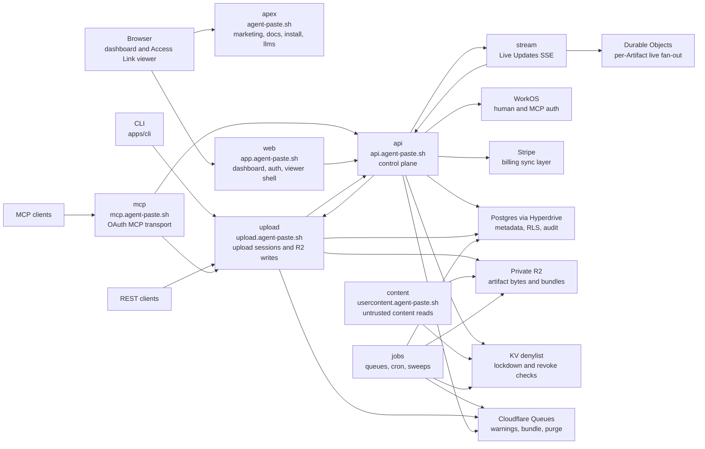
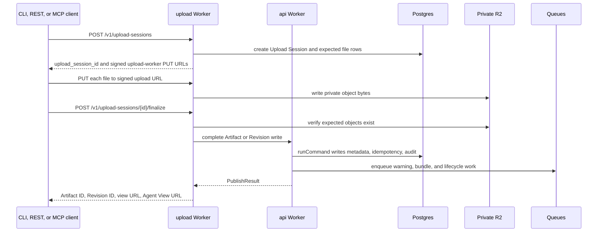
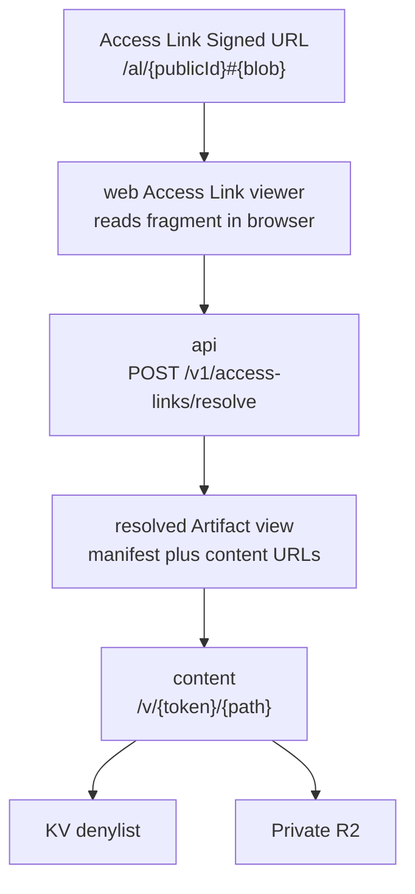
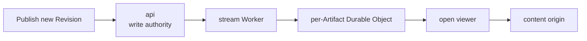
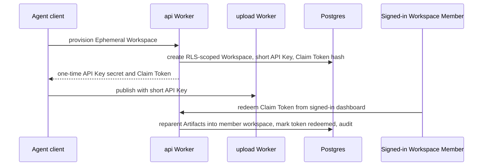

# Architecture Spec

This is the current system map for agent-paste. It describes how the hosted
service is split, how the main flows cross those boundaries, and where to find
the owning code and specs.

Specs own current behavior. ADRs explain why the shape was chosen. If this file
conflicts with a narrower spec, update this file or the narrower spec in the
same change rather than leaving the conflict for the next reader.

## System Shape

agent-paste is split by trust boundary, scaling profile, and storage access.
There is no single application Worker that can read and write everything.

## Host Boundaries

| Surface   | Owns                                                                                                                                      | Must not own                                                                                |
| --------- | ----------------------------------------------------------------------------------------------------------------------------------------- | ------------------------------------------------------------------------------------------- |
| `apex`    | Marketing page, public docs, legal pages, install scripts, `/llms.txt`, `/agents.md`, product redirects.                                  | Authenticated state, cookies, WorkOS callbacks, product data.                               |
| `web`     | Human dashboard, WorkOS session handling, Access Link viewer shell, claim and billing UI.                                                 | Postgres, R2, KV, queues, durable product writes. Durable work goes through `api`.          |
| `api`     | Authenticated control plane, Artifact metadata, Access Link resolve, web routes, operator routes, billing, ephemeral provision and claim. | Direct file-byte serving.                                                                   |
| `upload`  | Upload Sessions, signed upload-worker PUT URLs, validation, R2 writes, finalize orchestration.                                            | Unauthenticated content reads.                                                              |
| `content` | Signed file and Bundle reads from private R2 on the isolated Content Origin.                                                              | Hyperdrive, Postgres, WorkOS sessions, cookies, product mutations.                          |
| `jobs`    | Cron discovery, queue consumers, cleanup, bundle generation, warning replacement, billing reconciliation.                                 | Browser-facing routes.                                                                      |
| `stream`  | Long-lived SSE fan-out for Live Updates through per-Artifact Durable Objects.                                                             | Postgres, R2, KV, secrets, Untrusted Content.                                               |
| `mcp`     | OAuth-only Streamable HTTP MCP transport and fixed tool surface.                                                                          | Business writes, Postgres, R2. It verifies bearer shape and forwards to `api` and `upload`. |

## Publish Flow

The publish path creates or updates an Artifact without returning direct storage
URLs.

Key invariants:

- `CreateUploadSessionRequest` validates title, entrypoint, paths, file count,
  file size, and total size before bytes are accepted.
- Artifact lifetime is derived from server-side Workspace/Plan policy, not from
  client input.
- Upload PUT URLs are opaque upload-worker URLs, not R2 URLs.
- Finalize verifies every expected file exists before creating a Draft Revision.
- A separate publish mutation is required to transition a Draft Revision to a
  Published Revision.
- Durable mutations use idempotency keys where the route contract requires them.
- Durable business writes go through `runCommand` so state, audit, and
  idempotency records commit together.
- Publishing with `--artifact-id` creates and publishes a new Revision for that
  existing Artifact.

## Read And Share Flow

There are two public read shapes: direct signed content URLs and Access Link
Signed URLs. Both end at the Content Origin for file bytes.

Access Link rules:

- The shareable credential lives in the URL fragment, not in the path or query
  string.
- The fragment is read by the browser and posted to `api` as `{ public_id, blob
}`.
- The `access_links` row stores no bearer secret.
- Resolve failures are generic not-found responses.
- The `/al/{publicId}` viewer loads no analytics, external fonts, external
  images, or third-party scripts.

Content Origin rules:

- `content` verifies signed content token parse, signature, expiration, scope,
  denylist state, and path membership.
- `content` never reads Postgres and has no Hyperdrive binding.
- Direct R2 read URLs are never returned to clients.
- Authorization failures use generic not-found semantics.
- Per-Artifact unauthenticated reads are rate-limited as an abuse ceiling, not a
  billing meter.

## Live Updates

Live Updates let already-open Private Link or Share Link viewers advance to the
latest Published Revision after a publish.

The stream path relays only platform-controlled revision pointers. It never
proxies Untrusted Content and does not hold Postgres, R2, KV, or secrets.

## Ephemeral Publish And Claim

Ephemeral publish allows an unattended agent to publish without a prior human login.
It is a constrained tenant state, not an absence of tenant state.

Controls:

- Ephemeral Workspaces are ordinary RLS-scoped tenants with `claimed_at IS NULL`.
- The API Key is short-lived and low-cap.
- The Claim Token is returned once and stored hashed.
- Ephemeral content uses a script-disabled Execution Policy and `noindex`.
- Ephemeral Artifacts have the shortest Auto Deletion policy.
- Claim promotes the content into a normal Workspace and emits Audit Events.

## Security And Abuse Controls

This system does not claim uploaded content is safe. The security model is that
uploaded content is untrusted until isolated, scoped, expired, revoked, or locked
down.

| Control                                | What it protects                                                                                             |
| -------------------------------------- | ------------------------------------------------------------------------------------------------------------ |
| Worker split by boundary               | Limits which runtime can touch auth, metadata, bytes, queues, or long-lived connections.                     |
| Private R2                             | Prevents storage URLs from becoming public access paths.                                                     |
| Isolated Content Origin                | Keeps Untrusted Content off the dashboard and API origins.                                                   |
| Signed content tokens                  | Scope reads to one Revision, path set, expiration, and execution policy.                                     |
| Fragment Access Links                  | Keeps Access Link credential material out of server-side request paths and normal logs.                      |
| Hashed API Keys and Claim Tokens       | Stores verifier material, not bearer secrets.                                                                |
| Postgres RLS                           | Scopes tenant rows by Workspace inside database transactions.                                                |
| `runCommand`                           | Commits state changes with audit and idempotency records.                                                    |
| Denylist keys                          | Allows revocation, Access Link Lockdown, and Platform Lockdown to cut off reads before byte purge completes. |
| Content CSP and MIME allowlist         | Reduces browser blast radius and prevents agent-claimed MIME types from deciding render behavior.            |
| Ephemeral script-disabled policy       | Prevents no-login content from running script until claimed.                                                 |
| Rate limits and daily write allowances | Dampens abuse without gating legitimate reads for billing.                                                   |
| Operator lockdown                      | Gives operators a platform-level response path for abuse and takedown.                                       |
| Secret scanning and release provenance | Protects repository and CLI release hygiene. See [security-todo.md](../ops/security-todo.md).                |

Important limits:

- Warning metadata is advisory. Built-in rules can surface obvious risky
  patterns; the ephemeral path can also use Llama Guard and Cloudflare URL
  Scanner for warning and abuse-response signals. These do not certify content
  as safe and are not the trust boundary.
- File-bytes hash-reputation malware scanning through providers such as
  VirusTotal or MalwareBazaar is not part of the current shipped stack.
- Claimed tenants can run richer content under the claimed Execution Policy. The
  origin boundary, CSP, token scope, and revocation controls are the guardrails.
- Artifacts are transient handoffs, not permanent storage.

## Data Ownership

Postgres owns Workspace, Artifact, Revision, Access Link, billing, audit,
operation, and token-verifier metadata. R2 stores private Artifact bytes and
generated Bundles. KV stores denylist state needed by the DB-free Content
Origin. Queues and cron jobs do recoverable background work.

Tenant-owned tables are RLS-scoped by `workspace_id`. Runtime tenant queries use
transaction-scoped workspace context. Cross-tenant misses use not-found
semantics instead of leaking authorization details. The same isolation invariant
is guarded on the test surface: the local in-memory repository backend enforces
the run's workspace scope as a deliberate bug detector, throwing on a
cross-tenant `insert` rather than silently emulating RLS
([ADR 0083](../adr/0083-local-repository-backend-enforces-run-scope.md)).

## Where To Find Things

| Need                           | Start here                                                                                                                                   |
| ------------------------------ | -------------------------------------------------------------------------------------------------------------------------------------------- |
| Current feature inventory      | [features.md](./features.md)                                                                                                                 |
| Route behavior and auth labels | [api.md](./api.md) and `packages/contracts/src/routes.ts`                                                                                    |
| Public schema and wire shape   | [contracts.md](./contracts.md) and `packages/contracts`                                                                                      |
| Tenant schema and invariants   | [data-model.md](./data-model.md), `packages/db/src/schema.ts`, and migrations                                                                |
| Dashboard behavior             | [web.md](./web.md), `apps/web/src/routes`, and `apps/web/src/server`                                                                         |
| Content rendering and headers  | [content-rendering.md](./content-rendering.md), `apps/content`, and `packages/storage`                                                       |
| Jobs and cleanup               | [jobs.md](./jobs.md) and `apps/jobs`                                                                                                         |
| Ephemeral publish              | [ephemeral-publish.md](./ephemeral-publish.md), `apps/api`, `apps/upload`, `apps/cli`                                                        |
| Billing                        | [features.md](./features.md), [web.md](./web.md), `packages/billing`, and `apps/web`                                                         |
| Live Updates                   | [ADR 0069](../adr/0069-live-updates-via-stream-worker-and-per-artifact-durable-object.md), `apps/stream`, and `apps/api/src/live-updates.ts` |
| Repo ownership map             | [repo-navigation.md](../agents/repo-navigation.md)                                                                                           |

## Change Rules

- Update this file when a new app, Worker, storage binding, queue family, trust
  boundary, or user-visible read/write flow is added.
- Update the narrower owning spec in the same change.
- Keep public marketing copy weaker than this spec. The public site can explain
  the controls, but this file owns the exact claims.
